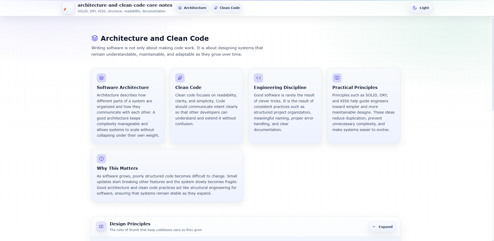

# Architecture and Clean Code - Core Notes

A structured collection of practical notes covering **software architecture, clean coding practices, and engineering design principles**.

---

---

This repository focuses on **writing maintainable, scalable, and production-ready software**.  
Instead of language-specific tricks, the goal is to understand the **principles that make software reliable over time**.

These notes are designed to be **clear, practical, and beginner friendly**, while still reflecting real-world engineering practices used in professional software systems.

---

## Topics Covered

- Design Principles
- SOLID Principles
- DRY - Don't Repeat Yourself
- KISS - Keep It Simple
- Project Structure
- Code Readability
- Error Handling Strategy
- Documentation

---

## Purpose of this Repository

Modern software systems grow quickly and often become difficult to maintain.  
Good architecture and clean code practices help developers:

- reduce complexity
- improve maintainability
- make systems easier to extend
- reduce bugs
- enable collaboration across teams

This repository acts as a **practical reference guide** for writing cleaner and better structured software.

---

## Learning Goals

By going through these notes, developers should understand how to:

- design software components clearly
- organize projects logically
- write readable and maintainable code
- apply fundamental design principles
- handle errors consistently
- document systems effectively

---

## Tech Stack

This notes site is built using a lightweight modern frontend stack.

- React
- Vite
- styled-components
- react-icons

---

## Follow Me

---

- GitHub: https://www.github.com/a2rp
- Portfolio: https://www.ashishranjan.net
- LinkedIn: https://www.linkedin.com/in/aashishranjan
- Facebook: https://www.facebook.com/theash.ashish/
- Youtube: https://www.youtube.com/@ashishranjan-ashz
