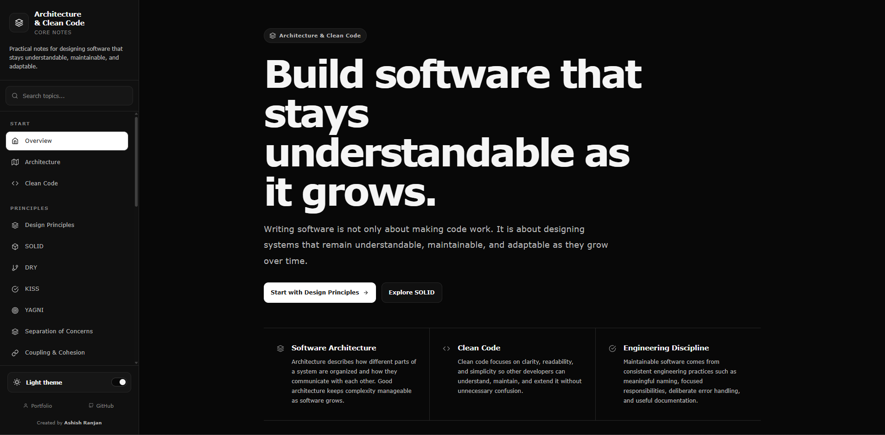

# Architecture and Clean Code - Core Notes

A structured and practical reference for learning **software architecture, clean code, design principles, code quality, scalability, and maintainability**.

---



---

## About

Architecture and Clean Code - Core Notes is an interactive notes application focused on the principles that help software remain understandable, maintainable, testable, and adaptable as it grows.

The content focuses on practical software engineering concepts rather than framework-specific tricks.

The application provides dedicated routed pages for each topic, a searchable navigation sidebar, light and dark themes, responsive mobile navigation, and structured examples for easier reference.

---

## Topics

### Foundation

- Overview
- Software Architecture
- Clean Code

### Design Principles

- Design Principles
- SOLID
- DRY - Don't Repeat Yourself
- KISS - Keep It Simple
- YAGNI - You Aren't Gonna Need It
- Separation of Concerns
- Coupling and Cohesion
- Abstraction
- Encapsulation
- Composition over Inheritance

### Code Quality

- Project Structure
- Naming
- Functions
- Code Readability
- Error Handling
- Validation
- Logging
- Configuration
- Documentation
- Refactoring
- Code Smells
- Testing and Testability

### Architecture and Maintenance

- Dependency Management
- Scalability
- Maintainability Checklist

---

## Features

- Dedicated route for every topic
- Lazy-loaded page components
- React Router based navigation
- Searchable sidebar navigation
- Active route highlighting
- Automatic active menu positioning
- Independent sidebar and content scrolling
- Smooth scroll to top on route changes
- Go to Top button after scrolling
- Light and dark themes
- Persisted theme preference
- Responsive mobile navigation drawer
- Mobile menu auto-close after navigation
- Suspense loading indicator
- Practical code examples
- Structured engineering checklists
- Responsive layouts
- Accessible keyboard-friendly controls

---

## Project Structure

```text
src/
│
├── components/
│   ├── footer/
│   ├── goToTop/
│   ├── layout/
│   ├── loader/
│   └── sidebar/
│
├── data/
│   └── navigation.js
│
├── pages/
│   ├── abstraction/
│   ├── architecture/
│   ├── cleanCode/
│   ├── codeReadability/
│   ├── codeSmells/
│   ├── compositionOverInheritance/
│   ├── configuration/
│   ├── couplingAndCohesion/
│   ├── dependencyManagement/
│   ├── designPrinciples/
│   ├── documentation/
│   ├── dry/
│   ├── encapsulation/
│   ├── errorHandling/
│   ├── functions/
│   ├── home/
│   ├── kiss/
│   ├── logging/
│   ├── maintainabilityChecklist/
│   ├── naming/
│   ├── projectStructure/
│   ├── refactoring/
│   ├── scalability/
│   ├── separationOfConcerns/
│   ├── solid/
│   ├── testing/
│   ├── validation/
│   └── yagni/
│
├── App.jsx
├── App.styled.js
├── index.css
├── main.jsx
└── theme.css
```

---

## Tech Stack

- React
- React Router
- Vite
- styled-components
- react-icons

---

## Getting Started

Clone the repository:

```bash
git clone https://github.com/a2rp/architecture-and-clean-code-core-notes.git
```

Move into the project directory:

```bash
cd architecture-and-clean-code-core-notes
```

Install dependencies:

```bash
npm install
```

Start the development server:

```bash
npm run dev
```

Create a production build:

```bash
npm run build
```

Preview the production build locally:

```bash
npm run preview
```

---

## Design Approach

The application uses a documentation-style layout with two independently managed areas:

- A persistent navigation sidebar for topic discovery
- A dedicated content area for reading individual topics

Navigation data is centralized in `src/data/navigation.js`, while individual topics are organized as route-level pages under `src/pages`.

Each page is lazy loaded so topic code is split into separate production chunks instead of loading the entire notes application upfront.

---

## Theme

The application supports both light and dark themes.

The selected theme is stored locally so the preference remains available across page reloads.

On the first visit, the application can use the system color preference as the initial theme.

---

## Navigation

The sidebar includes:

- Grouped topic navigation
- Search by topic or section
- Clear search control
- Active route highlighting
- Automatic active-item positioning
- Independent scrolling for long navigation lists

On smaller screens, the sidebar becomes a mobile navigation drawer.

---

## Routing

The project uses React Router with route-based lazy loading.

Direct routes include examples such as:

```text
/architecture
/clean-code
/solid
/code-readability
/testing
/dependency-management
/scalability
/maintainability-checklist
```

Vercel SPA rewrites are configured through `vercel.json` so direct route visits and browser reloads can resolve through the React application.

---

## Build Status

The production build has been verified successfully with:

```bash
npm run build
```

The dependency audit currently reports:

```text
0 vulnerabilities
```

---

## Purpose

The goal of this repository is to provide a practical reference for developers who want to improve how they design, structure, review, and maintain software.

The notes emphasize:

- clear responsibilities
- understandable dependencies
- simple designs
- readable code
- controlled complexity
- reliable error handling
- useful testing
- maintainable documentation
- deliberate scalability
- incremental improvement

---

## License

This project is licensed under the MIT License.

See the `LICENSE` file for details.

---

## Author

Developed by **Ashish Ranjan**.

---

## Links

- Portfolio: https://www.ashishranjan.net
- GitHub: https://github.com/a2rp
- CodePen: https://codepen.io/ash1198
- LinkedIn: https://www.linkedin.com/in/aashishranjan
- Facebook: https://www.facebook.com/theash.ashish/
- YouTube: https://www.youtube.com/@ashishranjan-ashz?sub_confirmation=1
