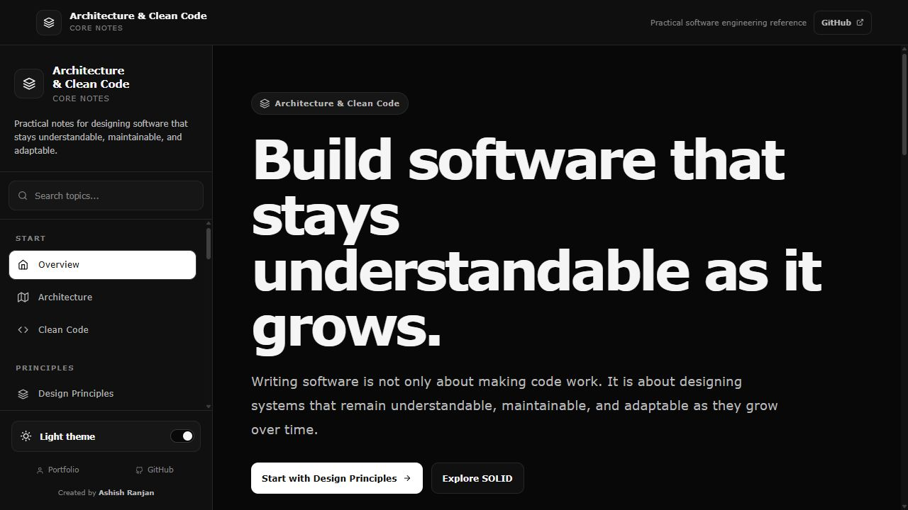

# Architecture and Clean Code Core Notes

An interactive React reference for software architecture, clean code, design principles, code quality, scalability, testing, and maintainability.



## Features

- Dedicated lazy-loaded route for every topic
- Searchable sidebar with active-link highlighting
- Responsive mobile navigation drawer
- Light and dark themes with saved preference
- Practical examples, checklists, and engineering notes
- Scroll-to-top control and independent content navigation
- Responsive, keyboard-friendly interface

## Tech Stack

React, React Router, Vite, JavaScript, React Icons, and CSS Modules.

## Getting Started

```bash
npm install
npm run dev
```

Run production checks:

```bash
npm run lint
npm run build
```

## Deployment

Live project: [https://a2rp.github.io/architecture-and-clean-code-core-notes/](https://a2rp.github.io/architecture-and-clean-code-core-notes/)

Deploy to GitHub Pages:

```bash
npm run deploy
```

## Future Prospects

- Add more architecture patterns and practical case studies.
- Add topic search, progress tracking, and saved notes.
- Add interactive diagrams for selected design and architecture concepts.

## Images

Project image assets are stored locally in `public/`. The root `screenshot.png` is the main home-screen preview.

## License

MIT License. Copyright (c) 2026 Ashish Ranjan.

## Links

- Portfolio: [https://www.ashishranjan.net/](https://www.ashishranjan.net/)
- GitHub: [https://github.com/a2rp](https://github.com/a2rp)
- CodePen: [https://codepen.io/ash1198](https://codepen.io/ash1198)
- LinkedIn: [https://www.linkedin.com/in/aashishranjan](https://www.linkedin.com/in/aashishranjan)
- Facebook: [https://www.facebook.com/theash.ashish/](https://www.facebook.com/theash.ashish/)
- YouTube: [https://www.youtube.com/@ashishranjan-ashz?sub_confirmation=1](https://www.youtube.com/@ashishranjan-ashz?sub_confirmation=1)
- Email: [ash.ranjan09@gmail.com](mailto:ash.ranjan09@gmail.com)

## Support

- Support: [https://a2rp-donation-page.netlify.app/](https://a2rp-donation-page.netlify.app/)
- Buy Me a Coffee: [https://buymeacoffee.com/a2rp](https://buymeacoffee.com/a2rp)
- Patreon: [https://patreon.com/a2rp](https://patreon.com/a2rp)
